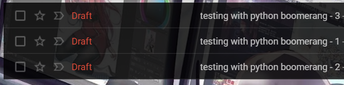
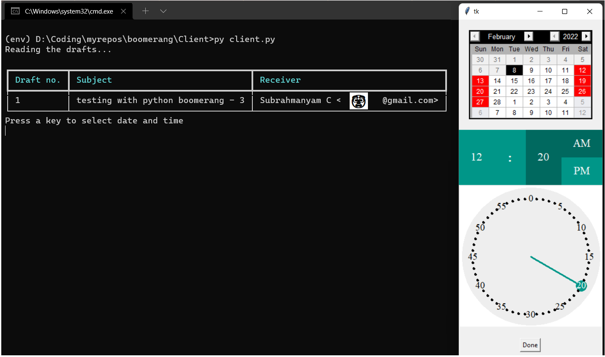
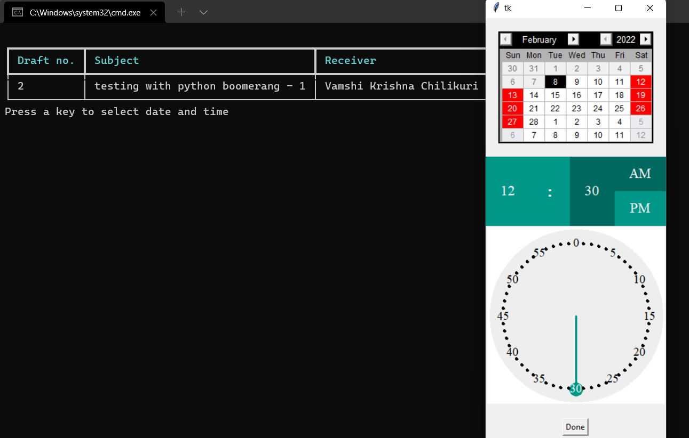
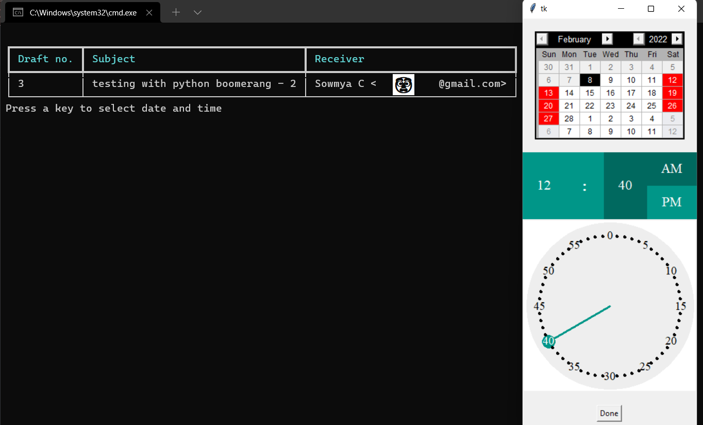
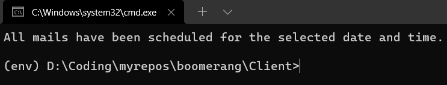
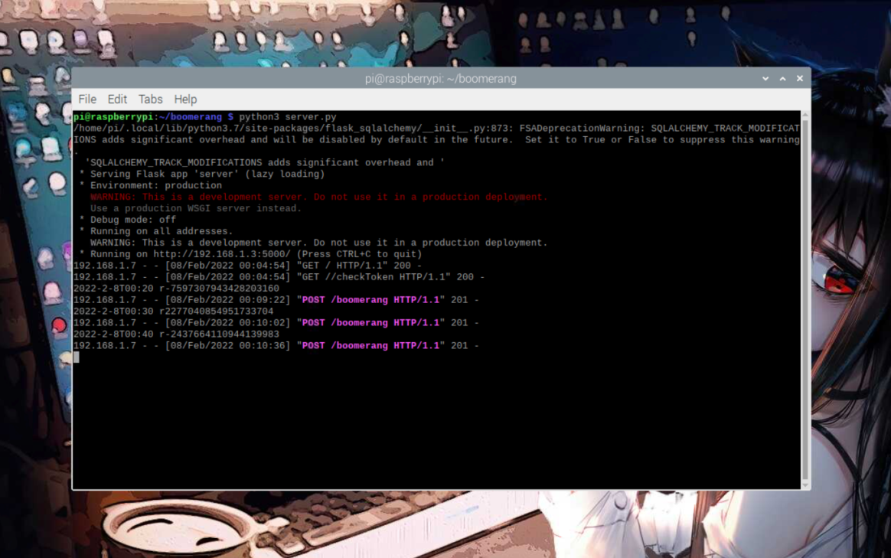
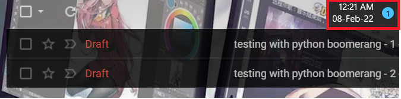
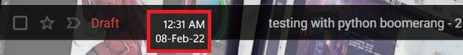
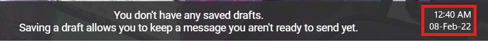

# Boomerang
An attempt to implement a _paid_ gmail service  in python using gmail API

## What's "[Boomerang](https://boomeranggmail.com/)"?

It's basically a third party service that helps you schedule mails in gmail for a specific date and time. But it's _paid_.

---

## What did I make?
I made an attempt to make this third party, paid, gmail scheduling service "boomerang" free with the help of Google API. So all you have to do is prepare the draft, save and run the client script to schedule your drafts.

---

## How everything works

Client side:
- Checks for an "[access token](https://auth0.com/docs/secure/tokens/access-tokens)".
    - If the access token doesn't exist in the machine, it asks for the user consent to read, send the user's drafts.
- Searches for the server IP on the local area network by sending a get request to '/' endpoint and saves the ip to `SERVERIP` file locally when found.
    - Exits when none found.
    - If the `SERVERIP` file already exists, it verifies if the ip address is still valid by sending a get request to '/' endpoint.
        - If the response is invalid, then it removes the `SERVERIP` file and starts the process again.
- Checks if the token exists in the server via '/checkToken' endpoint.
    - If it doesn't then it sends the token via '/authtoken' endpoint.
- Reads drafts from gmail.
- Reads the subject and receiver address to confirm with the user.
- Prompts to select date and time.
- Makes a post request to the server at '/boomerang' endpoint and sends the draft ID along with date and time as a json.

Server side:
- Converts the date and time to the desired format.
- Makes a schedule to send the draft at the specified date and time.
- Sends the mail at the specified date and time.

---

## What should you do

First time:
- Setup the server and server script
- Setup client script and credentials

Everytime:
- Create a draft with all the necessary information.
- Start client script and select the date and time for each draft.
- Wait for the magic to happen.

---

## How to set it all up

Server side:
- Get an embedded system like raspberry pi or some old unused laptop that has average or above average internet connection.
- Follow the instructions from [here](https://github.com/insaiyancvk/boomerang/tree/main/Server)
- Make sure the server is running all the time.

Make sure to setup the server as it is the one that makes schedules and sends the drafts.

Client side:
- Install python and pip on your PC.
- Follow the instructions from [here](https://github.com/insaiyancvk/boomerang/tree/main/Client)

---

## How it looks like

### The drafts:

---

### The client side UI:

---

### The server side:

---

## During the scheduled time

 

 

 

## Advantages
- You have complete control over the server, client, API, literally everything.
- The code is open source.
- Save [$60/year](https://www.boomeranggmail.com/subscriptions.html). Instead get a Raspberry Pi 4 for $50.

## TODO
- Be able to modify the scheduled date and time
- List scheduled mails