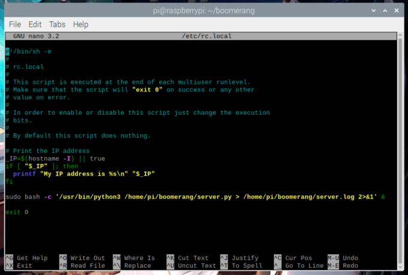
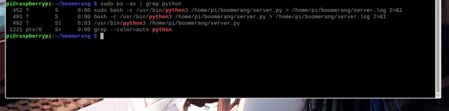

## Required dependencies
>Run the following command with superuser privileges the server is on linux

```
pip install --upgrade google-api-python-client google-auth-httplib2 google-auth-oauthlib flask flask_sqlalchemy apscheduler
```

## How to get the script?

1. You can clone the entire repository with:

``` git clone https://github.com/insaiyancvk/boomerang ```

- Change into the server directory:

``` cd Server ```

- Run the script

``` python server.py ```

2. Curl the server script (Recommended):

``` curl -o server.py https://raw.githubusercontent.com/insaiyancvk/boomerang/main/Server/server.py && python3 server.py ```

- Run the script

``` python server.py ```

## Setup the script to autostart on boot
_Assuming your server is RPi_

- Modify `rc.local`
    - `sudo nano /etc/rc.local`
- Add the following line at the end of the file
    - sudo bash -c '/usr/bin/python3 <path_to_server_script> > /home/pi/server.log 2>&1' &

For example, in my case it looks like this:



>Do not forget to add the ampersand (&) at the end of the line. It is needed so that the server script runs in a different process and does not block execution of the boot process. Without it, the rc.local script would wait for the server script to end before continuing. So it would wait till the program is executed and hence we'll never get an access to the interface.
- Reboot Pi
    - `sudo reboot`

- You can check for the code running in the background with:
    ```
    sudo ps -ax | grep python
    ```
- If you want to kill the server process:
```
sudo kill <PID>
```
The PID (process ID) of the server script, in my case is 492


- If you want to stop the server on boot:
    - Open rc.local file with `sudo nano /etc/rc.local`
    - Remove the line that starts the server script (at the end of the file)